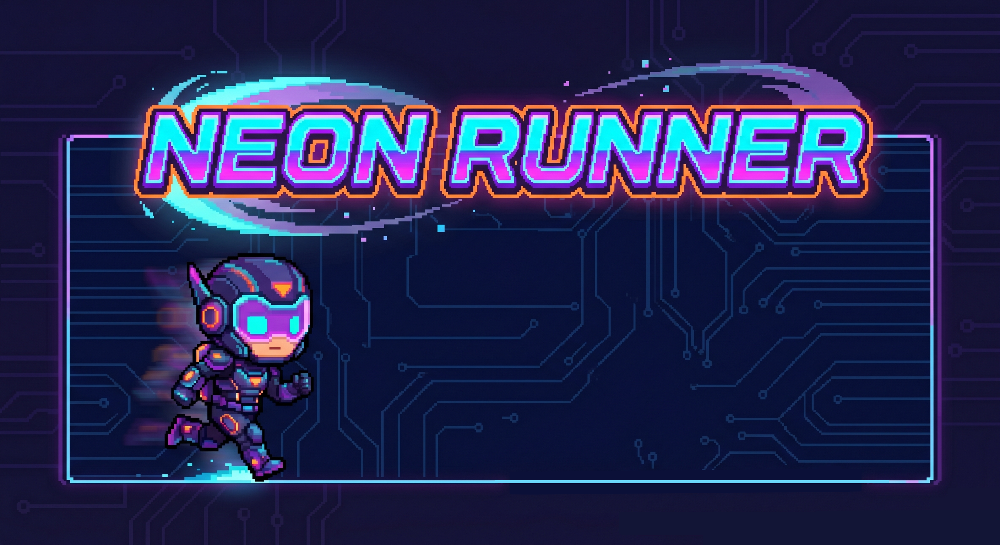

# 🚀 Neon Runner

Um jogo de plataforma *endless runner* em ritmo acelerado, construído com **HTML5 Canvas, CSS puro e JavaScript**. Desvie de abismos procedurais, gerencie sua estamina para voar e destrua ameaças cibernéticas com ataques melee precisos!

## 🎮 Funcionalidades e Mecânicas

- **Movimentação Avançada:** Sistema de pulo duplo, mecânica de voo por estamina e *Coyote Time* para saltos precisos na beirada das plataformas.
- **Combate Melee Dinâmico:** Use seu ataque físico para estilhaçar paredes colossais e eliminar inimigos terrestres e aéreos.
- **Sistema de Ricochete:** Intercepte projéteis inimigos com o *timing* perfeito do seu ataque e rebata-os de volta contra a ameaça mais próxima.
- **Geração Procedural Extrema:** Plataformas com variações agressivas de altura e abismos dinâmicos gerados em tempo real.
- **Sistema de Combo (x1.1+):** Elimine inimigos em sequência para aumentar seu multiplicador de pontos passivos e ativos. Tomar dano reseta o combo!
- **Drops de Sobrevivência:** 10% de chance de inimigos derrotados droparem corações para recuperar seu HP.

## 🕹️ Controles

- **Pular / Pulo Duplo / Voar (Segurar):** `W`, `Espaço` ou `Seta para Cima`
- **Ataque Melee:** `D`, `X`, `Seta para Direita` ou `Clique Esquerdo do Mouse`
- **Pausar / Despausar:** `P`

